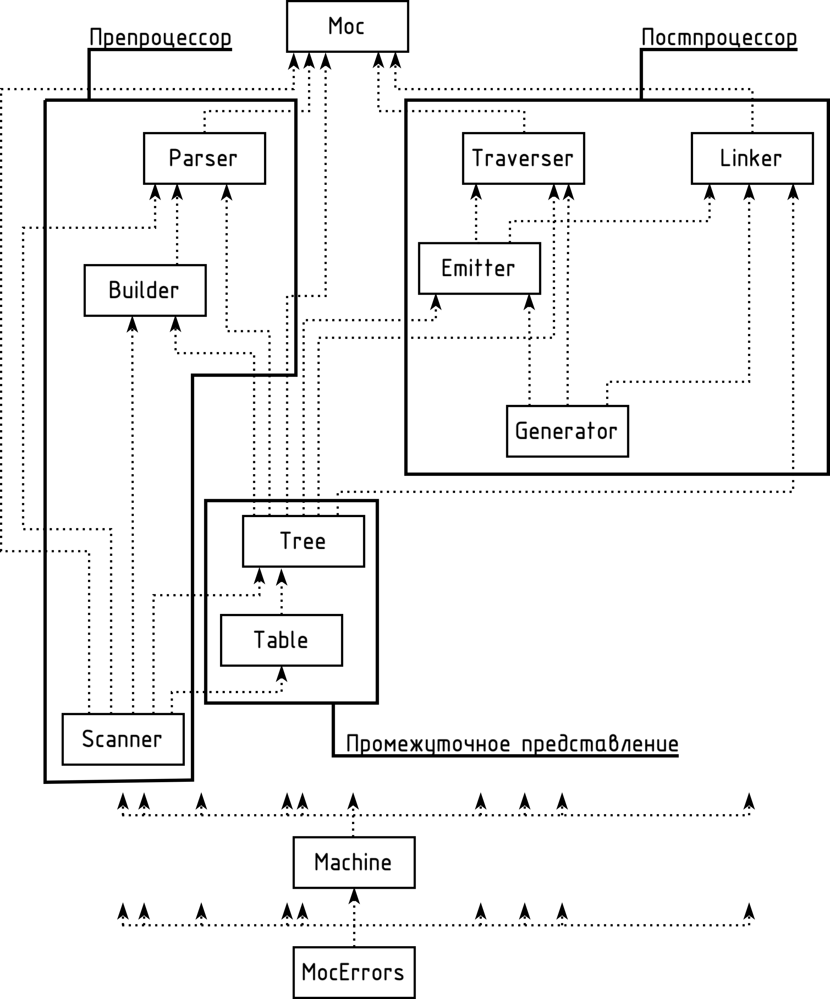

# Магистерская диссертация

» [moc.oberon.org](https://moc.oberon.org/)

Построение компилятора с языка программирования Оберон для процессора ARM64.

Ефимов Артур Игоревич

Рига, 2025 г.



## Установка необходимого программного обеспечения

### Требования

* LaTeX (XeLaTeX)
* Python 3.13 (не 3.14!)
* Make

### Установка на macOS

1. Установите [MacTeX](https://www.tug.org/mactex/)
2. Создайте виртуальное окружение Python и установите зависимости:

```bash
python3.13 -m venv .venv
source .venv/bin/activate
pip install pygments latexminted==0.5.1
```

**Важно:** Используйте Python 3.13, а не 3.14, т.к. latexminted 0.6.0 несовместим с Python 3.14.

3. Соберите документ:

```bash
make
```

Чтобы очистить:

```bash
make clean         # Оставляет PDF
make cleanall      # Сбрасывает всё
```

### Установка на Debian/Ubuntu

```bash
apt-get install -y texlive-full make python3-venv
python3 -m venv .venv
source .venv/bin/activate
pip install pygments latexminted==0.5.1
make
```

### Установка на Windows

1. Установите [MiKTeX](http://www.miktex.org)
2. Установите [TeXworks](https://github.com/TeXworks/texworks/releases)
3. Установите Python 3.13
4. Создайте виртуальное окружение и установите зависимости
5. Запустите компиляцию через make или вручную

## Структура проекта

* `disser.tex` - основной файл диссертации
* `broshura.tex` - брошюра (автореферат)
* `bibliography.bib` - библиография
* `lgu.cls` - стилевой файл LGU
* `tools/bin/` - вспомогательные скрипты для Python и pygmentize
* `.venv/` - виртуальное окружение Python (создается автоматически)

Система LaTeX устроена таким образом, что для того, чтобы вполне
перевести текст в формат PDF, иногда необходимо несколько раз
запустить процесс компиляции. Интегрированные среды разработки
на LaTeX'е, как правило, делают это сами. Находящийся в проекте
Makefile также учитывает это.


## Рисунки в формате PDF

SVG-файлы в каталоге figures образованы из исходных файлов в формате drawio
с помощью ситсемы на сайте draw.io. SVG-файлы переводятся из PDF-файлов
командой inkscape:

```
inkscape input.svg -o output.pdf
```

# Шрифты

В качестве шрифтов в книге использованы гарнитура Литературная (для основного текста)
и чертёжный шрифт (тип А) по ГОСТ СССР (для исходного кода).
Гарнитура Академическая не использована, но всё же поставляется.

В этих шрифтах добавлены ударения для некоторых кириллических букв, исправлена буква Ё,
исправлены некоторые метрики, добавлены латышские буквы и т. д. В чертёжном шрифте
добалена литера "стрелка вверх" (для использования её в качестве замены литере
"крышка" (^) в исходных кодах на Обероне), литеры "крышка" и "апостроф" сдвинуты вниз
(были они совсем высоко над строкой), уменьшен межбуквенный интервал вокруг литеры
"звёздочка" (*).

**Указанные шрифты созданы в СССР и принадлежат многонациональному народу Союза ССР.**

Шрифты должны находятся в подкаталоге fonts.
```
Literaturnaja.otf
Literaturnaja-Bold.otf
Literaturnaja-Italic.otf
Akademicheskaja.ttf
ChertjozhA.ttf
```
